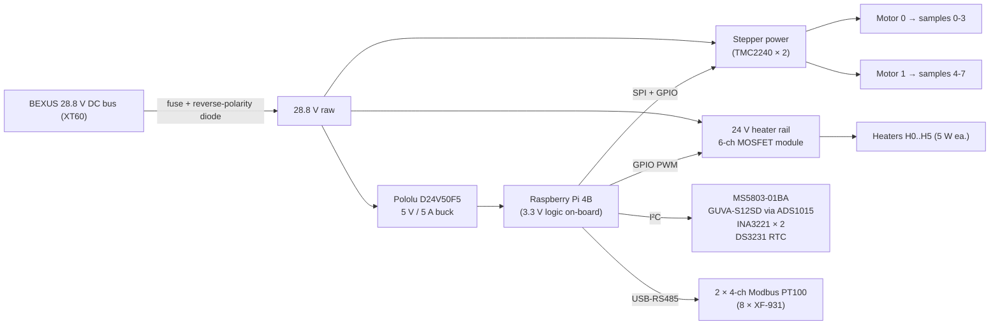
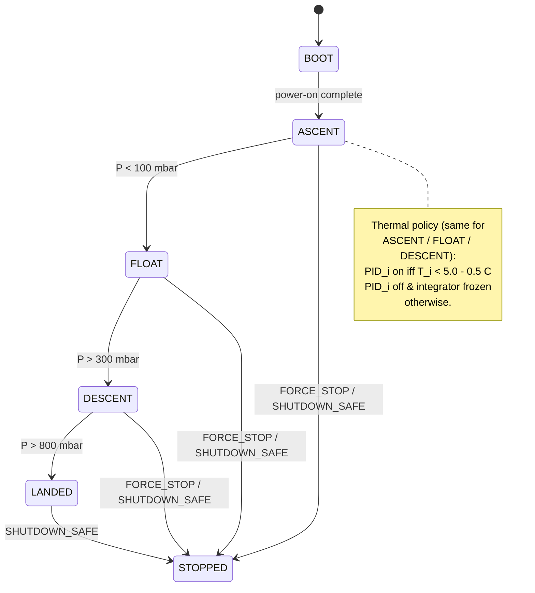
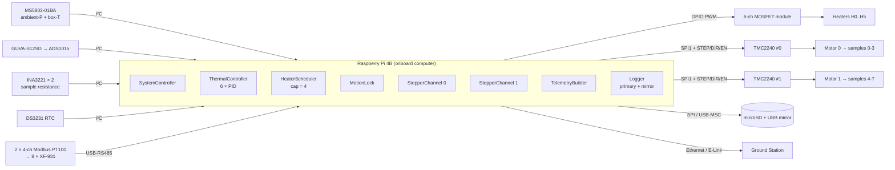
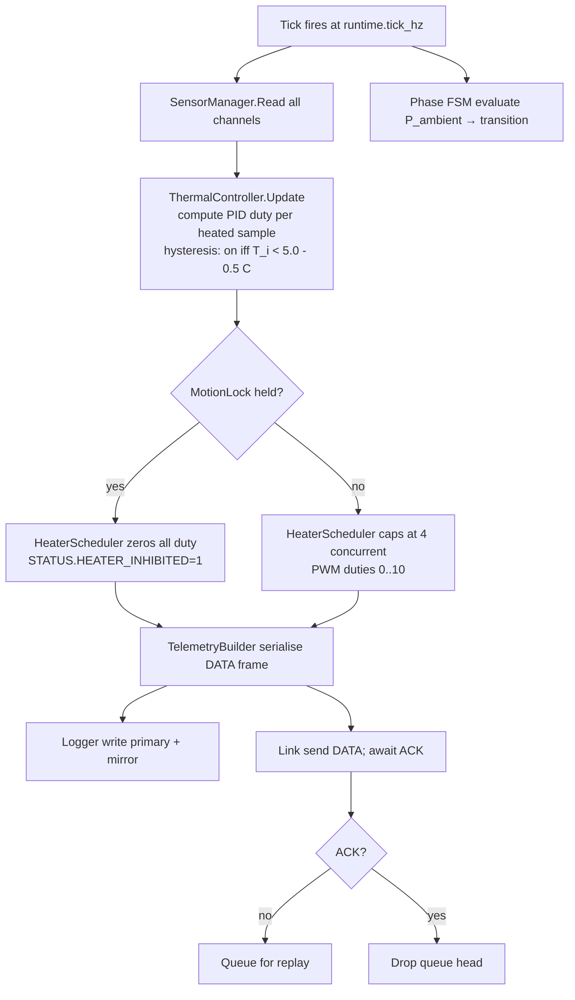
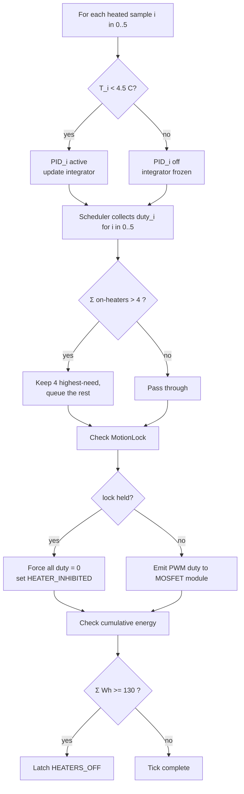

# SED — Software Architecture Update Report (Rev B.1 vs `soft_sed.odt`)

**Date:** 2026-04-17
**Scope:** `soft_sed.odt` sections *Power System*, *Duty Cycles & Operational Phases*, *Software Design*, *Ground Support Equipment*.
**Baseline:** [docs/CHANGELOG-RevB.md](CHANGELOG-RevB.md) + [docs/REV-B.1-VERIFICATION-LOG.md](REV-B.1-VERIFICATION-LOG.md).
**Verdict:** the current ODT is Rev A + early Rev B. It does **not** reflect the floor-only thermal policy, the mechanical-pull microcrack path, the 8-sample / 6-heater BOM, the MS5803 / ADS1015 / INA3221 / DS3231 / RS485 sensor stack, or the dual-TMC2240 motor stack. Every subsection below needs a rewrite; the table at the end of each block lists the exact deltas.

> Use this report as a diff-list: each line is either **REMOVE**, **MODIFY**, or **ADD**. Everything not listed should survive unchanged.

---

## 1. Power System

### 1.1 What the ODT currently says (high level)
- 223.9 Wh total need, "two batteries" on the gondola.
- DC-DC buck + "Pi-EzConnect HAT".
- Sensor array: PT100 via **MIKROE-2815 RTD amps**, **BME280**, **BPW21**.
- Three rails: 5 V (electronics), 12 V (two steppers, 15 min each, sequential), 28 V (heaters).
- **Nine 10 W Kapton heaters**; max 4 on → 40 W ceiling; system peak 48.23 W / 1.73 A.

### 1.2 What Rev B.1 actually uses ([CHANGELOG §Rev B.1 delta](CHANGELOG-RevB.md#rev-b1-delta-2026-04-17), [VERIFICATION-LOG §0](REV-B.1-VERIFICATION-LOG.md#0-canonical-rev-b1-facts-as-validated-by-the-team), [config/onboard.example.ini](../config/onboard.example.ini))
- **130 Wh** software-enforced energy budget (`power.energy_budget_wh=130.0`), derived from the BEXUS 150 Wh allocation minus ~20 Wh reserved for the Pi + sensors + I/O.
- Single rail from the **Pololu D24V50F5** (5 V / 5 A) off the 28.8 V gondola bus via XT60; no separate 12 V line, no second battery.
- **6 flight heaters** on samples 0–5, **5 W @ 24 V DC polyimide film**, max 4 simultaneous → **20 W thermal ceiling** (`power.max_thermal_w=20.0`, `power.heater_nominal_w=5.0`, `power.max_active_heaters=4`).
- Samples 6 & 7 are PT100-only (pulled by motor 1, no heater).
- Sensor rail: **MS5803-01BA** (ambient-P / box-T), **GUVA-S12SD + ADS1015**, **DS3231 RTC**, **INA3221 × 2** (sample resistance), 8 × **Labfacility XF-931 PT100** through 2 × 4-ch **Modbus-RTU PT100 collectors** sharing one **USB-RS485** adapter (`/dev/ttyUSB0`).
- Steppers do **not** sit on a dedicated 12 V rail — each is a TMC2240 configured over SPI with STEP/DIR/EN on GPIO, fed from the shared bus.

### 1.3 Deltas to apply to the Power-System section

| # | Action | Old text (approx.) | New text |
|---|---|---|---|
| P‑1 | **MODIFY** | "total energy need 223.9 Wh … two batteries" | Software enforces **130 Wh** cumulative energy budget (BEXUS 150 Wh allocation − 20 Wh reserve). Single BEXUS 28.8 V DC feed through XT60. |
| P‑2 | **MODIFY** | "DC-DC buck … Pi-EzConnect HAT … 3.3 V logic" | **Pololu D24V50F5** 5 V / 5 A regulator off the 28.8 V bus powers the Pi 4 and all I²C/SPI sensors (3.3 V logic is generated on the Pi). |
| P‑3 | **REMOVE** | references to **MIKROE-2815 RTD amp**, **BME280**, **BPW21** | Replaced by MS5803-01BA + ADS1015 + RS485 PT100 collectors (see §3 below). |
| P‑4 | **REMOVE** | "nine 10 W Kapton heaters … 100 W if all 9 on … 40 W max … 48.23 W / 1.73 A peak" | See P‑5. |
| P‑5 | **ADD** | new heater paragraph | **6 polyimide film heaters**, 5 W @ 24 V DC, driven by a 6-channel MOSFET module. Scheduler cap = 4 concurrent → **20 W peak thermal / ≈0.83 A @ 24 V**. 16 heaters procured (6 flight + 10 spares). |
| P‑6 | **REMOVE** | "12 V line only for steppers … 15 min each sequential" | The 12 V stepper rail is gone. Both motors are TMC2240-driven from the shared bus; `MotionLock` already serialises the two motors so only one pulls at a time. |
| P‑7 | **MODIFY** | power-budget tables (4.7.2.1 … 4.7.2.5) | Regenerate with: 5 V @ 1.7 A continuous electronics; 24 V heater line @ 0.83 A peak / 0.2 duty avg; stepper current = TMC2240 `run_current_a_rms=1.5` at the coil (not the bus). Target **Σ ≤ 130 Wh** over the full mission timeline. |
| P‑8 | **ADD** | software-side safeguard | Name the three software layers that enforce the budget: (i) `HeaterScheduler` hard cap of 4 concurrent heaters, (ii) `SystemController` cumulative energy integrator that forces `HEATERS_OFF` when Σ ≥ `power.energy_budget_wh`, (iii) `MotionLock` interlock that zeros heater duty during every pull (STATUS bit `HEATER_INHIBITED`). |
| P‑9 | **ADD** | protection list | Reverse-polarity diode + fast-acting fuse on the XT60 inlet; systemd `WatchdogSec=10` on the onboard service. |

### 1.4 Power-architecture diagram to add

Replace the current prose-only description with the block diagram below (Figure 4.7.1 in the new SED):



---

## 2. Duty Cycles & Operational Phases

### 2.1 What the ODT currently says
- Nine 10 W Kapton heaters, 100 W if all on; scheduler caps at 4 → 40 W / 1.43 A.
- **Ascent:** hold plates at **−30 °C** with short heater bursts.
- **Activation ramp:** heat plates **−30 °C → +70 °C at 0.85 °C/s** (fills the 48.23 W budget, temporarily drops the electronics heater).
- **Float:** hold **+70 °C for 90 minutes** (the "healing period").
- **Descent:** target **−20 °C floor** to stop the newly-healed polymer getting brittle.
- Microcrack induction is implicitly **thermal**.

### 2.2 What Rev B.1 actually does ([CHANGELOG §2](CHANGELOG-RevB.md#2-mission-phase-fsm), [VERIFICATION-LOG §0 "Phase FSM"](REV-B.1-VERIFICATION-LOG.md#phase-fsm))
- All Rev A phases (`ASCENT_HOLD`, `ACTIVATION_RAMP`, `FLOAT_HOLD`, `DESCENT_FLOOR`) are **deleted**.
- Mission FSM: `BOOT → ASCENT → FLOAT → DESCENT → LANDED` (+ `STOPPED`), with pressure transitions 100 / 300 / 800 mbar. No timed float hold.
- **Single thermal policy across ASCENT / FLOAT / DESCENT:** each per-sample PID is active only when `T_sample < 5.0 °C − 0.5 °C` hysteresis; above the floor the PID shuts off and its integrator freezes.
- **Microcracks are induced mechanically** by the two stepper motors pulling samples downward (one pull cycle = 200 full-steps ≈ 1 mm, hold `pull.hold_s`, retract). The **INA3221 pair** measures sample electrical resistance to detect crack formation in flight.
- No electronics-box heater; no `deprioritize_electronics` branch.
- Max 4 heaters on → **20 W** peak thermal, not 40 W. 6 heaters total, not 9.

### 2.3 Deltas to apply

| # | Action | Old text | New text |
|---|---|---|---|
| D‑1 | **REMOVE** | every mention of "−30 °C ascent target", "0.85 °C/s activation ramp", "+70 °C healing", "90 min float hold", "−20 °C descent floor", "electronics heater deprioritized" | Obsolete — the +70 °C mission was retired when the activation mechanism moved from thermal to mechanical. |
| D‑2 | **ADD** | new thermal-policy paragraph | All three flying phases share one rule: **"keep every heated sample (H0–H5) at or above +5 °C"**, with 0.5 °C hysteresis and integrator-freeze-when-off. Samples 6 & 7 are pulled but unheated — their PT100s are telemetered read-only. |
| D‑3 | **ADD** | mechanical-pull paragraph | Rev B.1 induces microcracks by pulling each sample with an OMC 17E19S2504BSM5-150RS NEMA-17 ball-screw stepper (1 mm lead). Max 100 full-steps/s, trapezoidal accel 200 steps/s², microstep 4× default. One cycle = 200 full-steps down → hold 5 s → retract to 0. `MotionLock` serialises the two motors; `HeaterScheduler` zeros all duty while the lock is held (STATUS `HEATER_INHIBITED`). |
| D‑4 | **ADD** | sample-resistance paragraph | Two INA3221 chips on I²C (0x40, 0x41) sample-resistance-monitor 6 of the 8 specimens (2 × 3 channels). Samples 6 & 7 render as `-` in telemetry. `Ina3221Adapter::healthy()` drives a new `RESISTANCE_OK` STATUS bit. |
| D‑5 | **MODIFY** | "nine 10 W Kapton heaters … 40 W … 25 W aggregate … 100 W if all 9 on" | **"Six 5 W polyimide heaters on samples 0–5. The scheduler caps concurrent heaters at four, so peak thermal load is 20 W (≈ 0.83 A at 24 V). The cumulative-energy integrator also latches heating off when Σ ≥ 130 Wh."** |
| D‑6 | **REMOVE** | "temperature regulation … ranging 0..10 duty" sample text | Still correct **in spirit** (the scheduler emits integer duty 0..10 per heater), but update the wording to make clear the **duty vector is length 6, not 10** — one entry per sample heater, no box entry. |

### 2.4 Phase-FSM diagram to replace the ODT's "ascent hold → activation ramp → float hold → descent floor" figure



---

## 3. Software Design

### 3.1 Purpose list (ODT §"Purpose")

| # | Action | Change |
|---|---|---|
| SW‑1 | **MODIFY** | "Temperature regulation … heaters … 0 (off) to 10 (max)" → keep, but scope it to **sample floor ≥ +5 °C**, 6 heaters, and note duty values are integers 0–10. |
| SW‑2 | **MODIFY** | "Sensor reading and management for ambient (temperature/pressure/humidity), temperature (heaters), voltage, UV" → replace humidity with **sample electrical resistance via INA3221**; voltage sensor line should be removed (INA3221 is used as a resistance instrument, not a supply monitor). |
| SW‑3 | **KEEP** | Data storage in a local log file with timestamps (primary SD + secondary USB mirror, newline-delimited CSV). |
| SW‑4 | **KEEP** | Data transmission to Ground Station. |
| SW‑5 | **KEEP** | Receiving and enacting commands from Ground Station. |
| SW‑6 | **MODIFY** | "Stepper control for applying micro-cracks" → make it explicit: **two TMC2240-driven stepper channels**, serialised by `MotionLock`, with a heater-duty interlock. |
| SW‑7 | **ADD** | New bullet: **Cumulative-energy enforcement**: `SystemController` integrates heater power and latches `HEATERS_OFF` when Σ ≥ 130 Wh. |
| SW‑8 | **ADD** | New bullet: **Mission FSM** with pressure-driven transitions (BOOT/ASCENT/FLOAT/DESCENT/LANDED/STOPPED). |

### 3.2 Process-overview block diagram (ODT Fig. 4.8.1) — full replacement



### 3.3 Interface table (ODT §"c. Interfaces") — full replacement

| # | Action | Row (A ↔ B) | Protocol | Physical |
|---|---|---|---|---|
| I‑1 | **REMOVE** | OBC ↔ PT100 "TS" **SPI** row | — | — |
| I‑2 | **ADD** | OBC ↔ 8 × PT100 (via 2 × 4-ch Modbus collectors) | **Modbus-RTU over RS-485** | USB-RS485 on `/dev/ttyUSB0` |
| I‑3 | **MODIFY** | OBC ↔ ambient sensor | I²C | **MS5803-01BA** (ambient-P **and** box-interior-T) |
| I‑4 | **MODIFY** | OBC ↔ UV | I²C | **GUVA-S12SD analog → ADS1015 (12-bit) ADC** |
| I‑5 | **ADD** | OBC ↔ INA3221 × 2 | I²C | addresses 0x40 & 0x41 (sample resistance) |
| I‑6 | **ADD** | OBC ↔ DS3231 RTC | I²C | UTC timestamp source |
| I‑7 | **MODIFY** | OBC ↔ TCS (heaters) | GPIO PWM | 6-channel MOSFET module → 6 polyimide heaters |
| I‑8 | **MODIFY** | OBC ↔ Stepper | **SPI configuration + STEP/DIR/EN GPIO** | Two **TMC2240** drivers (SPI1, distinct CS lines). Note: the ODT line "Stepper — PWM" is wrong; pulses are STEP edges on a GPIO line, not a PWM peripheral. |
| I‑9 | **KEEP** | OBC ↔ SD card (SPI) | | |
| I‑10 | **KEEP** | OBC ↔ USB stick (MSC) | | |
| I‑11 | **KEEP** | OBC ↔ GS (E-Link / Ethernet / TCP+UDP) | | |

### 3.4 Communication & commands (ODT §"d")

- **KEEP** the transport description (UDP discovery on 4100; TCP telemetry on 4000 with ACK; TCP commands on 5000; newline-delimited framing). These match `config/onboard.example.ini`.
- **FIX typo:** `DISAARM_DEBUG` → `DISARM_DEBUG`. Also accept `DISARM` alias.
- **ADD** the following commands that the ODT omits but the onboard parser already implements ([onboard/src/command_parser.cpp:150–186](../onboard/src/command_parser.cpp#L150-L186)):

| Category | Commands to add to SED |
|---|---|
| Operations | `SET_TICK_HZ`, `SET_BENCH_MODE`, `ENTER_SAFE`, `EXIT_SAFE`, `SECONDARY_CYCLE`, `ARM`, aliases `ON` / `OFF` / `RESET` |
| Radio | `RADIO_SILENCE`, `RADIO_RESUME` |
| Stepper (primary Rev B surface) | `STEPPER_MOVE`, `STEPPER_MOVETO`, `STEPPER_ROTATE`, `STEPPER_HOME`, `STEPPER_STOP`, `STEPPER_SET_SPEED`, `STEPPER_SET_MICROSTEP`, `STEPPER_ENABLE`, `STEPPER_DISABLE`, `STEPPER_BEND` |
| Pull cycle (Rev B.1) | `PULL_ARM <id>`, `PULL_EXECUTE <id>` |

Each command must be documented with its motor-id argument (legacy single-motor forms without an id route to motor 0).

### 3.5 Data acquisition & storage (ODT §"d. Data acquisition")

The ODT example packet is incomplete. Replace with the **Rev B.1 wire format** from [CHANGELOG-RevB.md §Rev B.1 delta, item 11](CHANGELOG-RevB.md#rev-b1-delta-2026-04-17) and [VERIFICATION-LOG §0 Telemetry](REV-B.1-VERIFICATION-LOG.md#telemetry-rev-b1-wire-format):

```
DATA,<session>,<seq>,<ts>,<rtc_valid>,
     <ambient_T>,<ambient_P>,<uv>,
     <sample_0>,<sample_1>,<sample_2>,<sample_3>,<sample_4>,<sample_5>,<sample_6>,<sample_7>,
     HEATER_DUTY=<d0>,<d1>,<d2>,<d3>,<d4>,<d5>,
     RESISTANCE=<r0>,<r1>,<r2>,<r3>,<r4>,<r5>,-,-,
     PHASE=<BOOT|ASCENT|FLOAT|DESCENT|LANDED|STOPPED>,
     MODE=<NOMINAL|SAFE|…>,
     STATUS=<bitfield>,
     STEPPER0=pos:<µsteps>,tgt:<µsteps>,hz:<f>,…
     STEPPER1=pos:<µsteps>,tgt:<µsteps>,hz:<f>,…

EVT,PULL,<session>,<pull_id>,<motor_id>,<ts>,<steps>,<hold_s>,<samples>
```

Key points to call out in the SED:

- **`<ambient_T>` is the MS5803 die temperature**, which is *physically* the box interior temperature (the chip is mounted inside the electronics box). Label it **"Box / Ambient T"** on the ground-station GUI.
- **No humidity column** (MS5803 has no humidity output; BME280 is not carried).
- **No separate box-temperature column** (same reading as ambient_T — see above).
- **8 sample columns** (was 9).
- **`HEATER_DUTY=` has 6 entries** (was 10 in Rev A — 9 samples + 1 box).
- **`RESISTANCE=` has 8 slots; slots 6 and 7 are always `-`** (no INA3221 channel feeds them).
- **STATUS bitfield** (append in this order, MSB→LSB or as defined in `status_flags.hpp` — current fields: `SD | USB | I2C | SPI | LINK | T_AMBIENT | P_AMBIENT | UNIFORMITY | OVERTEMP | ENERGY | RS485 | HEATER_ACTIVE/INHIBITED | RESISTANCE`).
- **`EVT,PULL`** is emitted once per completed pull cycle and is the authoritative source for the ground-station `<log>_pulls.csv`.
- The legacy single-`STEPPER=` fallback is **gone** in the onboard serializer; the ground station parser still accepts it for replaying Rev A logs.

### 3.6 Process-flow diagrams (ODT Fig. 4.8.2 + 4.8.3) — full replacement

Fig. 4.8.2 (data-collection flow) — the old "check if ascent is over / check if floating is over" lattice should be replaced by:



Fig. 4.8.3 (heater regulation) — the old "70 °C during ascent / constant during float / stop during descent" diagram should be replaced by:



---

## 4. Ground Support Equipment

### 4.1 ODT text
"Two laptops (primary + spare), E-Net / E-Link, 2 Mbps uplink/downlink, commands ON / OFF / RESET."

### 4.2 Deltas

| # | Action | Change |
|---|---|---|
| G‑1 | **KEEP** | redundant-laptop topology, 2 Mbps link caps, E-Link bearer, TCP/UDP ports. |
| G‑2 | **MODIFY** | Replace the "ON / OFF / RESET" sentence with the full Rev B command list (see §3.4). Keep `ON` / `OFF` / `RESET` documented as **aliases** for `FORCE_START` / `FORCE_STOP` / `RESET_CTRL`. |
| G‑3 | **ADD** | GUI panel list: **Motors** right-dock (M0 + M1 position / target / hz / microstep / enable), **Pull events** bottom-dock fed by `EVT,PULL`, **Resistance** panel (6 live traces, 2 grey for samples 6–7), **Box/Ambient T** trace labelled as MS5803, **Phase** indicator. |
| G‑4 | **ADD** | Log-on-disk artifacts: `<log>.csv`, `<log>_events.csv`, **`<log>_pulls.csv`**. |
| G‑5 | **ADD** | Reconnect behaviour: discovery on UDP 4100, failover to static IP after `comms.failover_grace_s`, automatic queue replay on link restoration (the GS deduplicates by `(session, seq)`). |

---

## 5. Glossary / BOM table to append at the end of the SED

Add a one-page BOM table so the reader can cross-check every sensor / actuator against Rev B.1. One row per device.

| Device | Qty | Role | Interface | Notes |
|---|---|---|---|---|
| Raspberry Pi 4B | 1 | OBC | — | Ubuntu / systemd |
| Pololu D24V50F5 | 1 | 28.8 V → 5 V / 5 A buck | — | XT60 inlet |
| MS5803-01BA | 1 | Ambient P + box-interior T | I²C | 10–1300 mbar, stratospheric float native |
| GUVA-S12SD | 1 | UV analog | analog → ADS1015 | 240–370 nm |
| ADS1015 | 1 | 12-bit ADC for UV | I²C | |
| INA3221 | 2 | Sample resistance (6 ch) | I²C (0x40 + 0x41) | Samples 6 & 7 unmeasured |
| DS3231 | 1 | RTC | I²C | Replaces DS1307 (temp-compensated) |
| XF-931 PT100 | 8 | Sample temperature | via Modbus collectors | One per sample |
| 4-ch Modbus PT100 collector | 2 | PT100 readout | Modbus-RTU / RS-485 | Shared USB-RS485 on `/dev/ttyUSB0` |
| TMC2240 | 2 | Stepper driver | SPI1 + STEP/DIR/EN GPIO | Both motors (the INI/docs `motor1.driver=a4988` string is vestigial and should be removed) |
| OMC 17E19S2504BSM5-150RS | 2 | NEMA-17 ball-screw stepper | — | 1 mm lead; 1 rev = 1 mm linear |
| 6-ch MOSFET module | 1 | Heater switching | GPIO PWM | One channel per heater |
| Polyimide film heater | 6 flight + 10 spares | 5 W @ 24 V DC | — | Samples 0–5 |

---

## 6. Checklist — what to change in `soft_sed.odt` before the next SED submission

- [ ] Rewrite Power Supply Overview paragraph (P‑1, P‑2).
- [ ] Remove BME280 / BPW21 / MIKROE-2815 references (P‑3).
- [ ] Replace heater specs throughout (P‑4, P‑5, D‑5).
- [ ] Remove 12 V stepper rail (P‑6).
- [ ] Regenerate all five 4.7.2.x power-budget tables and figures (P‑7).
- [ ] Add software-enforced-budget and protection paragraph (P‑8, P‑9).
- [ ] Delete Rev A phase narrative (D‑1).
- [ ] Add floor-only thermal paragraph (D‑2).
- [ ] Add mechanical-pull paragraph (D‑3).
- [ ] Add sample-resistance paragraph (D‑4).
- [ ] Rewrite SW purpose bullets (SW‑1…SW‑8).
- [ ] Replace Fig. 4.8.1 block diagram (use §3.2 mermaid above).
- [ ] Replace interfaces Table 4‑6 (use §3.3 table above).
- [ ] Expand commands list (§3.4), fix `DISAARM_DEBUG` typo.
- [ ] Rewrite DATA packet spec (§3.5).
- [ ] Replace Figs. 4.8.2 + 4.8.3 (use §3.6 mermaids).
- [ ] Expand GSE section (G‑2…G‑5).
- [ ] Append BOM table (§5).

---

## 7. Open items that should surface in the SED as "known follow-ups"

Carry the open-ticket list from [CHANGELOG-RevB.md §Known follow-ups](CHANGELOG-RevB.md#known-follow-ups-open-tickets) and [§6 Deferred work](CHANGELOG-RevB.md#6-deferred-work-open-tickets) into the SED so the review panel sees what's still pending:

1. Real I²C drivers for INA3221, MS5803-01BA, ADS1015, DS3231 (all stubs today).
2. `Rs485ModbusAdapter` + driver for the 2 × 4-ch PT100 collectors.
3. TMC2240 SPI configuration pass (falls back to plain `GpioStepDirStepperDriver` on non-simulated builds today).
4. Plumb `motor0.*` / `motor1.*` / `pull.*` INI keys through `config.cpp` into `StepperChannelConfig` (currently parsed-and-ignored; `SystemController::Initialize()` uses compiled-in defaults).
5. GPIO pin map for the 6-channel MOSFET module.
6. Drop the vestigial `motor1.driver=a4988` string — both channels are TMC2240.
